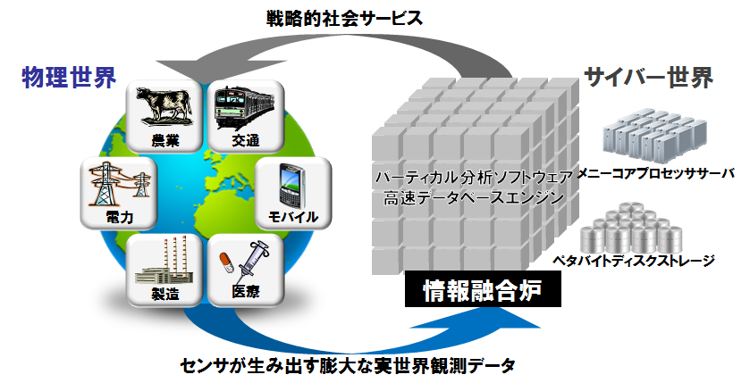
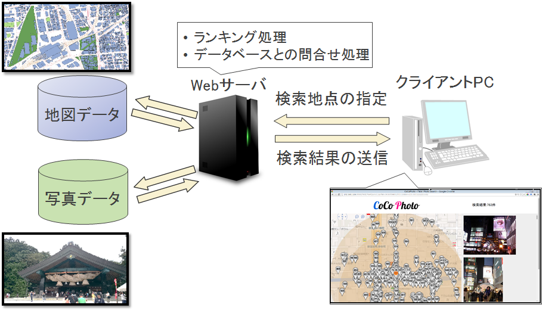

# CPS

## 構成員
-------
* 原 隆浩（教授）

## CPS(Cyber Phisical System)とは
-------
情報爆発，ビックデータ時代の真っ直中にいる現状では，身の回りで起こる様々な現象や事柄から，交通や医療などの公共サービスまでもが情報化されつつあります．今後は，実社会(=Phisical)に存在するこれらさまざまな情報を観測し，これにサイバー世界(=Cyber)の高度な解析を施すことにより，社会システムの抜本的な効率化を目指すサイバーフィジカルシステム（CPS）の考えが特に重要になってきています．
例えば，車両に取り付けられたセンサの情報を用いて，リアルタイムにWebで交通情報を閲覧できるようなサービスが考えられます．また，リアルタイムにセンサ情報を取得し続けることで，より高度な処理が可能となり，近い将来にどこで渋滞が発生しそうかを予測・回避することも可能であると考えられます．これはほんの一例であり，他にも医療や農業，電力など，様々な分野との連携が考えられます．
<!--情報爆発時代の真っ直中にいる現状において，ITが社会インフラに組み込まれていくにつれ，物理世界（実世界）とサイバー世界を統一的に扱うパラダイム，サイバーフィジカルシステム（CPS）の考えが特に重要になってきています．今後はセンサ情報が情報爆発の中心となり，多様なセンサ情報から実世界の情報を収集し，これに高度な解析を施すことにより，社会システムの抜本的な効率化を目指すCPSサービスが構築されると予測されます．-->

本プロジェクトでは，物理世界とサイバー世界をつなぐCPSサービスに必要な技術について研究を行っています．

## 研究テーマ
-------
### 現在進行中の研究テーマ
#### メタデータを利用した写真検索
スマートフォンなどの普及に伴い，twitterやinstagram，Flickrなどの写真投稿・共有サービスで公開されている写真が増加しています．スマートフォンにはGPSや方位など各種センサが搭載されており，センサが取得したデータ（メタデータ）を写真に付加して公開することも多くなりました．このような写真の利用方法として，利用者が指定した位置が撮影された写真
を検索し，閲覧することが挙げられます．しかし，撮影位置や方向によっては，建物等の遮蔽物により指定位置が隠れていたりしており，指定位置を撮影した写真の検索に，余分な多数の写真を閲覧することがありました．
そこで本研究では，写真に付加されたメタデータと地図のデータから建物の情報を取得し，これらの余分な写真を閲覧しないような検索方法を考えています．

## 主な研究業績
-------
### 国内会議
1. 谷山 雄基, 義久 智樹, 原 隆浩, 西尾 章治郎, "指定位置を撮影した写真を撮影条件と地図情報により検索するシステム," 情報処理学会マルチメディア，分散，協調とモバイル(DICOMO2015)シンポジウム論文集, pages 1301-1308, 2015年7月.