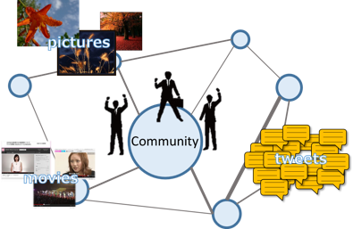

# データ検索

## 構成員
-------
* 原 隆浩（教授）
* 前川 卓也（准教授）
* 天方 大地（助教）

## データ検索とは
---
近年，「ビッグデータ時代」と称されるように，データ及びそれらを管理するシステムの増加に伴い，膨大な量のデータの中からユーザにとって有益なデータのみを検索する技術がますます重要視されています．例えば，ユーザが最も興味を示す上位k個のデータを検索するTop-k検索，ユーザが指定したクエリオブジェクトに最も近いオブジェクトを検索する最近傍データ検索などが代表的です．しかし，ビッグデータ時代においては，管理されるデータは増大・多様化が著しいため，目的のデータを検索することは難しく，あるいは処理時間が増加しています．そのため，データ検索を高速化する技術やフレームワークの開発が求められています．

## ソーシャルデータ
---
TwitterやFacebook，およびFlickrといったSNSが普及し，多くのユーザが日々の出来事をテキスト，画像，および動画などの様々な形式のデータを発信しています．このようなデータは，従来のWebコンテンツよりもリアルタイム性が高く，SNSを利用するユーザはこれらを参照することで，現実で起きているイベントを知ることができます．しかし，大量のデータの中からユーザにとって満足度の高いデータを検索するのは簡単ではなく，工夫したアルゴリズムを用いなければ検索にかかる時間が非常に長くなってしまいます．
私達の研究グループでは，友達・お気に入りといったユーザ同士の「つながり」をモデル化したソーシャルグラフと呼ばれるデータ構造を利用することで，大量に生成されるデータの中から個人に対して最適なデータを検索するフレームワークを設計しています．加えて，従来の最近傍検索のように指定地点からの距離を考慮する，あるいは指定されたキーワードとの関連度を併せて考慮するような，より高度な検索手法についても研究しています．

## モバイルセンサデータ
---
近年，ユーザが所持するスマートフォンなどのモバイルセンサ端末によって環境情報を収集する，ユーザ参加型センシングと呼ばれるデータ収集方法に注目が集まっています．ユーザ参加型センシングでは，ユーザが自由に移動した地点で環境情報を観測でき，センシングデータを収集・分析することで，広い地理範囲についてきめ細かい知識を得られます．例えば，大気汚染指数や騒音指数をセンシングし分析することでグリーンマップを作成する，といった応用が期待されます．しかし，センシングデータは大量に収集されるため，その中から目的に応じたデータを高速に検索する技術が求められます．
私達の研究グループでは，ユーザが任意に定義可能な，注目するセンシング属性値から算出されるスコアについて，地理的に分散した上位k個のデータを検索する手法などを研究しています．これにより，大量のデータの中から実世界の様子を端的に表すデータを厳選し，ユーザに対して高速に提供できます．

## 分散データベース・クラウド
---
これまでに挙げてきたデータは時々刻々と生成され，しばしばリアルタイムな分析が要求されます．一方で従来の集中管理型の処理方式では，ストレージやCPU，メモリといった計算機性能の限界により，データの生成速度に追従する分析は難しくなります．Hadoop/MapReduceに代表される分散処理フレームワークは，このような障壁を排除し，集中管理型では難しいとされるデータ分析を可能とします．
しかし一般的に，データやプログラムモジュールが分散配置される分散データベースにおいては，データ処理アルゴリズムは集中管理型よりも複雑になります．私達の研究グループでは，分散データベースにおける高度な検索技術の高速化手法，およびシステムの設計・開発などを行っています．

## 主な研究業績
-------
### 論文
1. Daichi Amagata, Takahiro Hara, and Makoto Onizuka, "Space Filling Approach for Distributed Processing of Top-k Dominating Queries," IEEE Transactions on Knowledge and Data Engineering (TKDE), 2018.
2. Daichi Amagata and Takahiro Hara, "Mining Top-k Co-Occurrence Patterns across Multiple Streams," IEEE Transactions on Knowledge and Data Engineering (TKDE), 2017.
3. Daichi Amagata, Takahiro Hara, "A General Framework for Maxrs and Maxcrs Monitoring in Spatial Data Streams," ACM TSAS 2017.
4. Kamalas Udomlamlert, Takahiro Hara, and Shojiro Nishio, "Subscription-Based Data Aggregation Techniques for Top-K Monitoring Queries," World Wide Web, 2017.
5. Daichi Amagata, Yuya Sasaki, Takahiro Hara, and Shojiro Nishio, "Efficient Processing of Top-k Dominating Queries in Distributed Environments," World Wide Web, 2016.
6. Daichi Amagata, Yuya Sasaki, Takahiro Hara, and Shojiro Nishio, "Probabilistic Nearest Neighbor Query Processing on Distributed Uncertain Data," Distributed and Parallel Databases, 2016.

### 国際会議
1. Masahiro Yokoyama and Takahiro Hara, "Efficient Top-k Result Diversification for Mobile Sensor Data", International Conference on Distributed Computing Systems, June 2016.
2. Daichi Amagata and Takahiro Hara, "Monitoring MaxRS in Spatial Data Streams," International Conference on Extending Database Technology, pages 317-328, March 2016.
3. Daichi Amagata, Takahiro Hara, and Shojiro Nishio, "Distributed Top-K Query Processing on Multi-Dimensional Data with Keywords," International Conference on Scientific and Statistical Database Management (SSDBM 2015), pages 10:1-10:12, June 2015.
4. Yuya Sasaki, Wang-Chien Lee, Takahiro Hara, and Shojiro Nishio, "Sky R-Tree: an Index Structure for Distance-Based Top-K Query,"  International Conference on Database Systems for Advanced Applications (DASFAA), pages 220-235, April 2014.