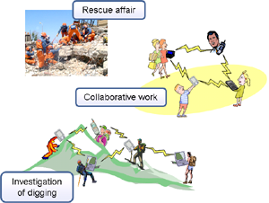
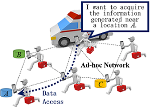

# Ad-hoc Network

## Members
-------
* Takahiro Hara (Professor)
* Daichi Amagata (Assistant Professor)
* Keisuke Goto (Ph.D 3rd year)
* Yuka Komai (Ph.D 3rd year)
* Boqi Gao (Master 1st year)
* Yuki Nakayama (Master 1st year)

## Ad-hoc Network?
-------
Recent advances in radio communication and computer technologies have led to the development of mobile computing environments. In mobile computing environments, users equipped with portable computers, called **mobile host**, can change their locations while retaining network connections by utilizing wireless communication. As one of the research fields in mobile computing environments, there has been an increasing interest in **ad hoc networks** constructed by only mobile hosts. In ad hoc networks, every mobile host plays the role of a router, and communicates with each other. Even if the source and the destination are not in the communication range of the two mobile hosts, data packets are forwarded to the destination by relaying transmission through intermediate mobile hosts. Since no special infrastructures are required, many applications such as rescue affairs at disaster sites and inter-vehicle communication are expected to be developed in ad hoc networks. In ad hoc networks, since the network topology dynamically changes due to the movement of mobile hosts, different fundamental technologies from the conventional fixed networks are needed.

 

## Research Topics
-------
### Location-Based Services

Location-based service is a typical application in ad hoc networks which are composed of a large number of mobile nodes in a wide area.
In a location-based service, it is common that queries to search the information on a specific location in real time which is held by mobile nodes are issued.
For example, in a disaster site, where a rescue worker acquires the k nearest data items (e.g., information about victims and damage of buildings) from his/her current location in a disaster site.
If the query-issuing node receives all the data items within the entire network, a substantial amount of unnecessary traffic is generated.
We have proposed k nearest neighbor and continuous (monitoring) range query processing methods for minimizing traffic and maintaining high query accuracy in ad hoc networks.

### Security Issue

In ad hoc networks, if a normal node becomes malicious owing to an attack from outside the network, the malicious node tries to disrupt the operations of the system. In this case, the user who has the malicious node operates normally but the malicious node does various attacks (e.g. DoS attack such as blackhole attack). We consider a security of top-k queries in ad hoc networks, in which data items are ordered according to a particular attribute score, and query-issuing nodes acquire the data items with the k highest scores in the network.

## Selected Publications
-------
### Journal

1. Komai, Y., Sasaki, Y., Hara, T., and Nishio, S.: k Nearest Neighbor Search for Location-Dependent Sensor Data in MANETs, IEEE Access, Vol. 3, No. 1, pp. 942-954 (Dec. 2015).
2. Komai, Y., Sasaki, Y., Hara, T., and Nishio, S.:kNN Query Processing Methods in Mobile Ad Hoc Networks, IEEE Transactions on Mobile Computing, Vol. 13, No. 5, pp. 1090-1103 (May 2014).

### International Conferences

1. Tsuda, T., Komai, Y., Hara, T., and Nishio, S.: Signature-Based Top-K Query Processing Against Data Replacement Attacks in MANETs, Proc. of International Symposium on Reliable Distributed Systems (SRDS 2015), pp. 130-139 (Sept. 2015).
2. Komai, Y., Hara, T., and Nishio, S.: Processing Convex Hull Queries in MANETs, Proc. of International Conference on Mobile Data Management (MDM 2015), pp. 64-73 (June 2015).
3. Amagata, D., Sasaki, Y., Hara, T., and Nishio, S.: A Robust Routing Method for Top-k Queries in Mobile Ad Hoc Networks, Proc. of International Conference on Mobile Data Management (MDM 2013), pp, 251-256 (June 2013).