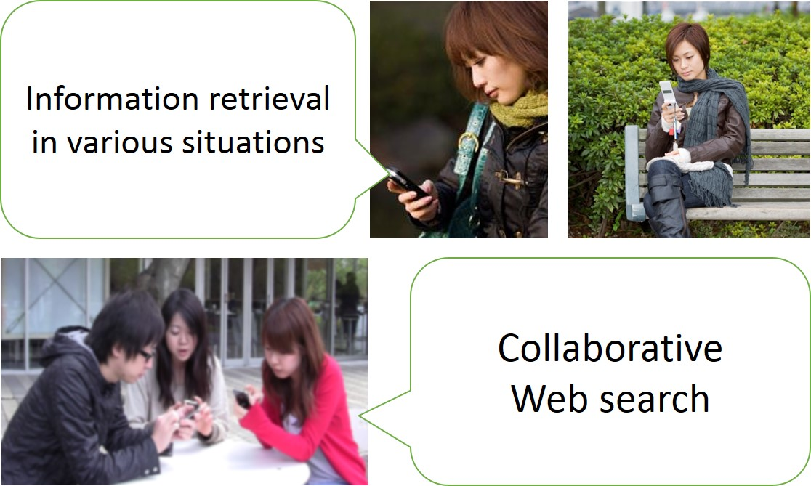
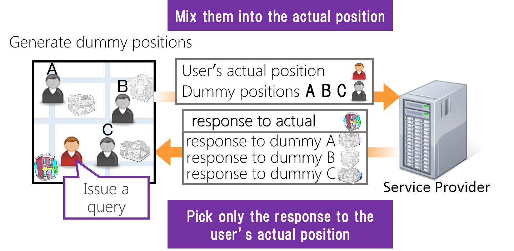
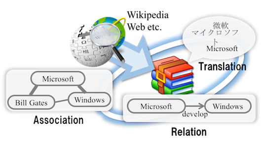

# Contents

## Members
-------
* Takahiro Hara (Associate professor)
* Kotaro Nakayama (Collaborative researcher)
* Masumi Shirakawa (Research assistant professor)
* Haruka Majima (Doctor 3rd year)
* Jun Osawa (Doctor 2nd year)
* Tatsuya Nakamura (Doctor 1st year)
* Noriyuki Matsuoka (Master 2nd year)
* Seiya Mizuno (Master 2nd year)
* Keiji Kawakami (Master 1st year)
* Shuhei Hayashida (Bachelor 4th year)
* Takashi Miyauchi (Bachelor 4th year)

## Mobile Web
-------
<!--
Recently, cellular phones have been widely used to access the WWW (World Wide Web) due to their progress in processing and communication facilities. Such trend is apparent from the fact that most of the new released cellular phones have Web browsers, which facilitate to access the WWW. However, most existing Web pages are designed for desktop PCs, thus, it is inconvenient to browse them using cellular phones, which only have small screens and poor interfaces such as direction pads and numerical keys.

Now that people always take cellular phones with them and use cellular phones when they need, which means that they can access WWW to get information anywhere, anytime. Therefore, improving the usability on Web browsing using cellular phones makes people's life more convenient.

Many researches have been actively conducted to realize comfortable Web browsing using cellular phones around the world.
 -->

Recently, smartphones are widely used to access the WWW (World Wide Web) due to their progress in processing and communication facilities. However, it is difficult for users to find proper information and applications from an enormous information source. In a mobile environment, users uses their smartphones in various situations, thus, request for information changes when the user's situation changes.

In addition, recently multiple mobile users often perform Web retrieval collaborately. However, existing Web retrieval systems are basically designed for a single user.

We actively conduct researches to realize comfortable Web searching and recommendation of information. For example, supporting system of collaborative Web search and recommendation system considering users' contexts.

 
##Location Privacy
-------
As the mobile devices equipped with GPS have been widely spread, a number of Location Based Services (LBS) have been provided. In LBSs, users are required to send their positions to the Service Provider (SP) and then they can enjoy the services according to their positions (e.g. Searching nearby restaurants, Map Services). However it has the risks of privacy breach because SP and sometimes other adversaries attack to SP have access to users' position data. Thus, the technology for protecting users' Location Privacy is getting more and more important.

Our group are conducting research on practical location privacy protection method that takes geographical and physical restrictions into account. In our previous works, we realized the location privacy protection method using dummy generation for the walking users and drivers.

## Wikipedia & Web mining
-------
Recently, with the amount of data on the Web growing up rapidly, it has become more difficult to find the necessary information. Web mining is a generic name of the research that extracts useful information by analyzing the space on the Web. Web mining is the very wide research field as follows: strategy of crawling the necessary information efficiently, indexing of the collected information to storage, link structure analysis (PageRank, HITS), contents analysis, log analysis, and so on.

Our group is conducting the research on Web mining to acquire more advanced knowledge for computers by analyzing a vast amounts of data on the Web and extracting useful knowledges. Wikipedia mining is one of the main research topic of us. In our previous works, we proposed the methods, which analyze a vast amount of data on the web considering the features of the data, and realized the scalable and accurate method for thesaurus dictionary construction. 

## Selected Publications
-------
### Journal
1. Masumi Shirakawa, Kotaro Nakayama, Takahiro Hara, and Shojiro Nishio, "Wikipedia-Based Semantic Similarity Measurements for Noisy Short Texts Using Extended Naive Bayes," IEEE Transactions on Emerging Topics in Computing, volume 3, number 2, pages 205-219, June 2015.
1. Takuya Sugitani, Masumi Shirakawa, Takahiro Hara, and Shojiro Nishio, "A Method for Detecting Local Events Using the Spatiotemporal Locality of Microblog Posts," Int'l Journal of Web Information Systems (IJWIS) , volume 11, number 1, pages 2-16, May 2015.

### International Conferences
1. Masumi Shirakawa, Takahiro Hara, and Shojiro Nishio, "N-Gram IDF: a Global Term Weighting Scheme Based on Information Distance," Proc. of Int'l World Wide Web Conf. (WWW 2015), pages 960-970, May 2015.
1. Masumi Shirakawa, Takahiro Hara, and Shojiro Nishio, "MLJ: Language-Independent Real-Time Search of Tweets Reported by Media Outlets and Journalists," Proc. of Int'l Conf. on Very Large Data Bases (VLDB 2014), pages 1605-1608, September 2014.
1.  Ryo Kato, Mayu Iwata, Takahiro Hara, Akiyoshi Suzuki, Yuki Arase, Xing Xie, and Shojiro Nishio, "A Dummy-Based Anonymization Method Based on User Trajectory with Pauses," Proc. of Int'l Conf. on Advances in Geographic Information Systems (GIS 2012), pages 249-258, November 2012.