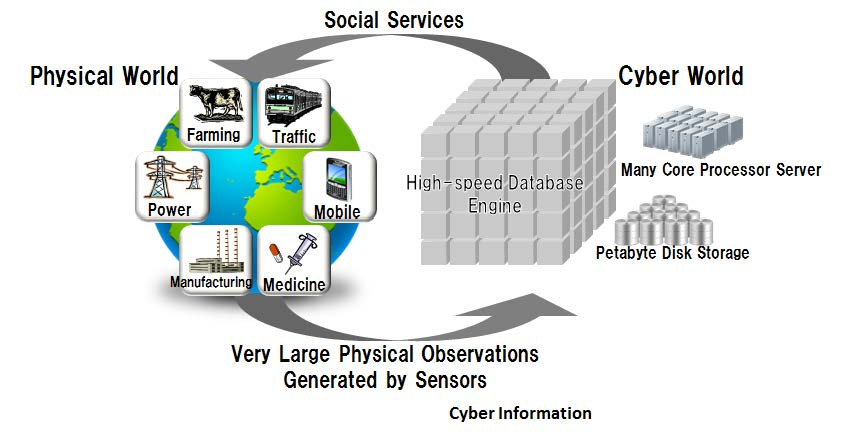

# CPS

## Members

* Takahiro Hara (Professor)
* Tomoki Yoshihisa (Associate professor)
* Yuki Taniyama (Master 1st year)
* Keisuke Nakashima (Bachelor 4th year)

## What is CPS (Cyber Physical System) ?
-------
Recent advances in capability of computers and network infrastructures, peer-to-peer(P2P) networks and applications have been becoming popular and a large number of researches projects on P2P systems are ongoing. P2P applications provide scalability and load balancing because a node communicates with other nodes and acts as both client and server in P2P networks.
In the environment of more and more information is exchanged, P2P applications enhance efficiencies of searching and sharing of more information and data items.

 

## Research Topics
-------
### Currently Ongoing Topics
#### A Scoring Method to Retrieve Photographs Showing Designated Points
Due to the spread of compact cameras such as smartphones and tablets, many photographs are uploaded and shared in the Internet. In cases that the camera is equipped with sensors, their data can be included to the photographs as the meta data. Such meta data are used to retrieve the photographs that cover the user's designated point. In existing systems, the users search the photographs that are taken in constant distance from the designated point. However, some of the searched photographs do not cover the point because of the different angles or hidden by buildings. So, the users often check many photographs to get their desirable photographs. 
we propose a scoring method of the possibility that the designated point is covered by the photographs. By showing the photographs that have higher scores with more priority, the number of the photographs that the user has to check can be reduced.

### Past Topics

#### Spatio-Temporal Data Distribution Visualization System for Mobile Sensor Data Retrieval

With the development of sensor technologies in recent years, there has been much attention to study on utilizing mobile sensor data generated by mobile sensor devices. Here, the distribution of such kind of data tends to be spatially and temporally ununiform. Therefore, in order to assists users to retrieve such an 'ununiformly distributed' data, it is needed to provide a system that helps users to grasp spatio-temporal distribution of sensor data. 
To make it easier to retrieve mobile sensor data , we proposed a novel system that visualizes spatio-temporal distribution of sensor data in order . Our system divides a map interface into grids and overlays a 2-dimensional histogram which shows the spatial distribution of the number of sensor data. The system also provides the temporal distribution of sensor data which are currently shown in the map interface. 

## Selected Publications
-------
### Journal
### International Conferences
