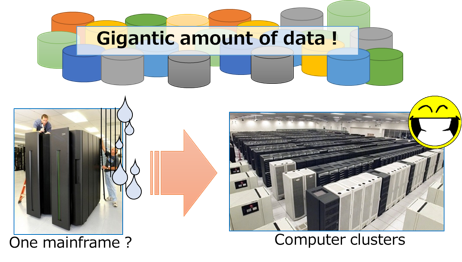

# Query Processing

## Members
-------
* Takahiro Hara (Professor)
* Daichi Amagata (Assistant Professor)
* Kamalas Udomlamlert (Ph.D 2nd)
* Masahiro Yokoyama (Ph.D 2nd)
* Naoya Taguchi (Bachelor 4th year)
* Syunnya Nishio (Bachelor 4th year)

## Query Processing?
-------
In recent years, the amount of data and data management systems have been increasing. In association with it, it becomes more important to retrieve useful data from large amounts of data. For example, a top-k query, that retrieves the k most attractive data, and a nearest neighbor query, that retrieves the data which is the nearest w.r.t. a query object, are typical queries. However, in the era of big data, data are remarkably diversified, and it is difficult to retrieve user-requiring data from huge amounts of data. It is therefore necessary to develop techniques and frameworks that retrieve data satisfying users' requirements in short time.

## Social Data
---
Along with the widespread use of SNS such as Twitter, Facebook and Flickr, many people broadcast usual events they experienced in many kinds of data form such as texts, pictures or movies. These data reflect the real world better than existing Web contents, so SNS users can know the events by referring to them. But it is not easy to retrieve data satisfying each user from huge amounts of data, and it takes too long time to search them without sophisticated algorithms.
Our research group has been designing frameworks utilizing a social graph, that expresses connections among users such as friends or favorites. By considering this data structure, we can find more personalized data for users. In addition, we have been studying more advanced query processing methods, where we consider relevances with query keywords and distances from a query object together.

## Mobile Sensor Data
---
Recently, there are many ways to get sensor data and the participatory sensing model attracts attention. In the participatory sensing, sensor data are generated by mobile devices people have such as smartphones. These sensor data have broad area's environmental information, so by analyzing them, we can get rich knowledge and utilize them for decision making. For example, by sensing and analyzing air pollution levels and noise levels, green maps can be made. However, because huge amounts of sensing data are collected, techniques that can retrieve useful data in short time are needed.
For example, our research group has been studying a top-k result diversification method. This query retrieves the spatially distributed k data that have high scores, that is worth noting data for users. By using this query, we can carefully select data showing the real world well from large amounts of data and provide them with users in short time.

## Distributed Database / Cloud Database
---
The data we referred above are generated consistently, and they are often requested to be analyzed in real time. On the other hand, in a traditional central processing model, the limit of computing capability makes high-speed and real-time data analysis difficult. But distributed processing fremework such as Hadoop/MapReduce can remove such barrier.
In general, however, data processing algorithms in distributed frameworks are more complicated than those in central frameworks because data and program modules are allocated at distributed components. Our research group has been designing sophisticated techniques or systems for information retrieval.

## Selected Publications
-------
### Journal
1.  Daichi Amagata, Yuya Sasaki, Takahiro Hara, and Shojiro Nishio, "Efficient Processing of Top-K Dominating Queries in Distributed Environments," World Wide Web Journal, 2015.
2.  Daichi Amagata, Yuya Sasaki, Takahiro Hara, and Shojiro Nishio, "Processing Probabilistic Nearest Neighbor Queries on Distributed Uncertain Data," Distributed and Parallel Databases, 2015.
3.  Daichi Amagata, Takahiro Hara, and Shojiro Nishio, "Sliding Window Top-K Dominating Query Processing Over Distributed Data Streams," Distributed and Parallel Databases,  2015.

### International Conferences
1. Daichi Amagata, Takahiro Hara, and Shojiro Nishio, "Distributed Top-K Query Processing on Multi-Dimensional Data with Keywords," International Conference on Scientific and Statistical Database Management (SSDBM 2015), number 10, June 2015.
2. Yuya Sasaki, Wang-Chien Lee, Takahiro Hara, and Shojiro Nishio, "Sky R-Tree: an Index Structure for Distance-Based Top-K Query,"  International Conference on Database Systems for Advanced Applications (DASFAA), pages 220-235, April 2014.