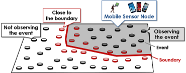

# Real-world Sensing

## Sensor Networks?
-------
In recent years, the development of radio communication technologies and semiconductor technologies has made possible the miniaturization and high-function of radio communication and sensor devices. There has been an increasing interest in Sensor networks, which consist of sensor devices that have radio communication ability. In sensor networks, sensor nodes are deployed and acquire sensing data in surroundings, and share the data each other with radio communication. Multi-hop communication through the multi sensor nodes makes possible the sharing between the nodes whose distance is over the limit of radio communication ability.
It can acquire the sensing data in wide range, and it is suited for some application, the environment or animal monitoring, backup system for disaster relief, the automation in the building administration, and the research for the planets for example. Currently, sensor networks using mobile sensor nodes that can migrate freely with actuators are receiving a lot attention.
 

## Research Topics
-------
## Efficient data gathering in mobile wireless sensor networks
We assume mobile sensor networks, specially urban sensing which are constructed by smartphone and wearable devices held by ordinary people. In an urban sensing, since there are many sensor nodes, the network is congested when the sink gathers sensor data from all sensor nodes. On the other hand, it is not necessary to gather sensor data from all sensor nodes in order to satisfy requirements of some applications like the urban sensing. 

For example, an application requires shapes and locations of events where sensor readings are higher than the threshold like sudden rain and areas with high concentration of particle (PM2.5, pollen). In this case, it is desirable to detect nodes close to the boundary and gather sensor data only from these nodes. To solve this problem, it is important to achieve a minimum number of nodes which send sensor data. In this figure, we show a example of nodes close to the boundary. We have studied efficient data gathering methods like the above in dense mobile sensor networks.

## Route construction and maintenance for multi-attribute data gathering
In applications such as environmental monitoring, it is general that sensornodes are usually battery powered. Therefore, it is important to save energy consumption of sensor nodes for prolonging the service lifetime. In environmental monitoring, some applications simultaneously gather sensor readings with different attributes(e.g., gathering temperature and atmospheric pressure). In addition, in wireless sensor networks, some sensor nodes may fail and then become unusable. The node failures cause failures of the data gathering or the monitoring.
Our research group study topology construction methods to prolong the system lifetime in an environment where the application gathers multi-attribute sensor data. In addition, we study fault-tolerance topology construction methods for wireless sensor networks where some sensor nodes may fail.

## Selected Publications
-------
### Book Chapter
Kazuya Matsuo, Keisuke Goto, Akimitsu Kanzaki, Takahiro Hara, and Shojiro Nishio, "Data Aggregation and Forwarding Route Control for Efficient Data Gathering in Dense Mobile Wireless Sensor Networks," Modelling and Processing for Next Generation Big-Data Technologies (Book Series: Modelling and Optimization in Science and Technologies), Springer-Verlag, November 2014.
### International Conferences
Kazuya Matsuo, Keisuke Goto, Akimitsu Kanzaki, Takahiro Hara, and Shojiro Nishio, "Overhearing-Based Efficient Boundary Detection in Dense Mobile Wireless Sensor Networks," Proc of IEEE Int'l Conf. on Mobile Data Management (MDM 2014), pages 225-234, July 2014.
