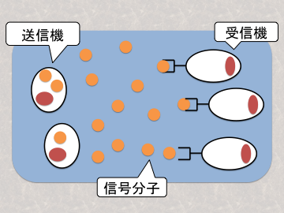
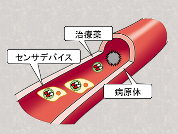

# 分子通信

## 構成員
-------
* 原 隆浩（教授）
* 中野 賢（准教授 -生命-）
* 大渕 拓也（博士後期課程1年）

## 分子通信とは
-------
分子通信とは、情報のキャリアとして分子を用いる通信方式です。分子通信において送信機から送られる情報は、分子の濃度や種類、形状などに変調され、信号分子として受信機へと伝えられます。このような信号分子のやりとりは、生物の内部、具体的には細胞内や細胞間、組織間で実際に行われている活動であり、分子通信は生物学からインスピレーションを受けた学際的な研究分野です。生物を構成する細胞が実際に分子のやりとりを行うことから、分子通信は細胞サイズのような微小なスケールのネットワークに適用できるという特徴があります。
分子通信を用いたネットワークを実現するためには、既存の情報通信技術を応用した工学的な視点からの取り組みとナノテクノロジーを活用した生物学的な視点からの取り組みの連携が必要です。我々の研究グループでは工学的な視点から活動を行っており、生物学分野の研究者と協力して分子通信ネットワークを構築することを目指しています。

## 研究テーマ
-------
### 分子通信を用いたセンサネットワークの構築

我々の研究グループでは、センサとして機能するデバイスが分子通信によって連携を行う、センサネットワークを構築するための研究を行っています。特に、我々が目標とするセンサネットワークでは、各デバイスは分子通信を用いて互いに連携をとりながら自律的に移動して環境中をセンシングします。環境中のセンシングによって病原体のような標的の存在などを監視し、必要に応じてセンサデバイス自身が治療薬を放出することで健康状態を維持します。このようなアプリケーションを実現するために、現在デバイス間の連携方法について取り組んでおり、自律的に移動するセンサデバイスが分子通信を使って協調し、標的の探索・検出を行うセンサデバイスの移動方式に関する研究を行っています。

## 主な研究業績
-------
### 国際会議
1. Takuya Obuchi, Yutaka Okaie, Tadashi Nakano, Takahiro Hara, and Shojiro Nishio, "Inbody Mobile Bionanosensor Networks Through Non-Diffusion-Based Molecular Communication," Proc. of IEEE Int'l Conf. on Communications (ICC 2015), pages 2681-2687, June 2015.
