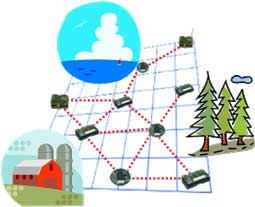
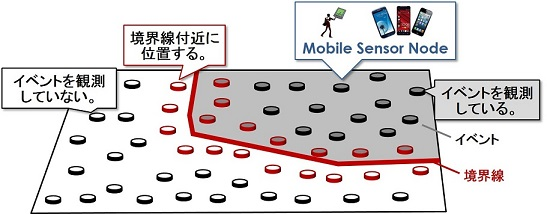

# センサネットワーク

## 構成員
-------
* 原 隆浩（教授）

## センサネットワークとは
-------
近年の無線通信技術や半導体技術の進展により、無線通信デバイスやセンサデバイスの小型化、高機能化が進んでいます。このような背景のもと、無線通信機能を搭載したセンサデバイスを用いて構築するセンサネットワークに対する関心が高まり、盛んに研究が行われています。センサネットワークでは、分散配置されたセンサ端末が周辺をセンシングし、無線通信を用いて取得したセンシングデータを共有します。また、複数のセンサ端末を介してマルチホップな通信を行うことにより、無線通信範囲を超えたデータの共有を可能にします。 センサネットワークは、大規模数のセンサ端末を用いて広範囲をセンシングできるため、環境や動植物のモニタリング、災害救助活動の支援、 建物管理のオートメーション化、惑星観測など、様々なシステムへの利用が期待されています。また、最近はセンサ端末にアクチュエータを搭載し、移動する機能を備えた移動型センサの開発が進んでおり、これらを用いた研究も盛んに行われています。

 

## 研究テーマ
-------
## モバイルセンサネットワークにおける効率的なデータ収集について
一般ユーザが所持するセンサデバイスを搭載したウェアラブル端末やスマートフォンをセンサ端末とするモバイルセンサネットワークでは、センサ端末の数が非常に多くなります。
そのため、全てのセンサ端末からセンサデータを収集すると、トラヒックが大量に発生してしまい、ネットワークの帯域を圧迫したり、端末のバッテリを浪費してしまうといった問題が発生します。
このモバイルセンサネットワークは主に都市センシングへの応用が期待されていますが、都市センシングのようなアプリケーションの中には、一部のセンサ端末からセンサデータのみで、その要求を満たすことができるものもあります。
例えば、アプリケーションがPM2.5・花粉などの微粒子の濃度が高い領域やゲリラ豪雨など、観測値が一定値以上の値を示す領域（イベント）の位置と形状を要求する場合、その領域の境界線付近に位置するセンサ端末のセンサデータさえあれば、イベントの位置と形状を推定できます。
この場合、データ収集時におけるトラヒックを削減するために、境界線付近に位置する端末を検出し、それらの端末のみからデータを収集することが望まれます。
図では、イベントの境界線付近に位置する端末の例を示しています。
これまでに私たちは、上述のアプリケーションを始めとして、様々な想定における、端末が密に存在するモバイルセンサネットワークでの効率的なデータ収集手法を提案しています。

## 複数属性のセンサデータの収集を考慮した通信経路の構築およびそのメンテナンス
無線センサネットワークの技術を用いた、環境モニタリングのようなアプリケーションでは、電池駆動のセンサ端末を用いることが一般的です。そのため、センサ端末の低消費電力化を図り、システム全体の長寿命化を目指した研究が盛んに行われています。また、環境モニタリングでは、ある一つの情報だけではなく、温度や気圧など、複数の属性の情報を観測することも考えられます。さらに、無線センサネットワークでは、センサ端末に故障などの不具合が発生し、一部のセンサ端末が使用不可能になってしまうこともあります。センサ端末が故障してしまうと、通信経路が分断され、観測したデータを収集できなくなったり、モニタリングそのものが不可能になったりするといった問題が発生してしまいます。そこで私たちの研究グループでは、複数の属性の情報を観測する場合でも、全属性の情報を長期間収集できるような通信経路を構築する手法に関する研究や、一部のセンサ端末が故障してしまっても、観測したデータの収集やモニタリングの継続を可能とする手法に関する研究を行っています。
## 主な研究業績
-------
### 書籍
Kazuya Matsuo, Keisuke Goto, Akimitsu Kanzaki, Takahiro Hara, and Shojiro Nishio, "Data Aggregation and Forwarding Route Control for Efficient Data Gathering in Dense Mobile Wireless Sensor Networks," Modelling and Processing for Next Generation Big-Data Technologies (Book Series: Modelling and Optimization in Science and Technologies), Springer-Verlag, November 2014.
### 論文
松尾 和哉, 後藤 啓介, 神崎 映光, 原 隆浩, 西尾 章治郎, "モバイルセンサネットワーク上の欠損データ再収集のためのエージェント制御方式," 情報処理学会論文誌, volume 57, number 2, 2016年2月.
松尾 和哉, 後藤 啓介, 神崎 映光, 原 隆浩, 西尾 章治郎, "密なモバイルセンサネットワークにおけるセンサデータの傍受とダイアグラムを用いた効率的な境界線検出手法," 情報処理学会論文誌, volume 56, number 3, pages 1107-1120, 2015年3月.
### 国際会議
Kazuya Matsuo, Keisuke Goto, Akimitsu Kanzaki, Takahiro Hara, and Shojiro Nishio, "Overhearing-Based Efficient Boundary Detection in Dense Mobile Wireless Sensor Networks," Proc of IEEE Int'l Conf. on Mobile Data Management (MDM 2014), pages 225-234, July 2014.
